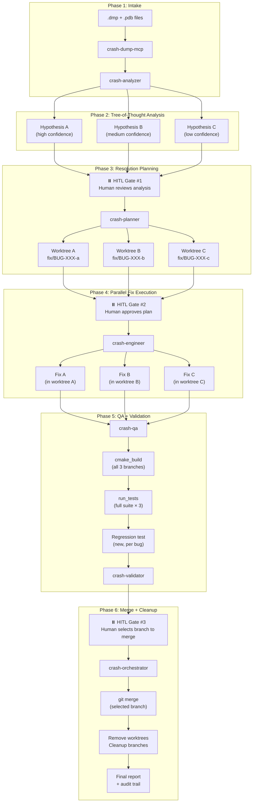
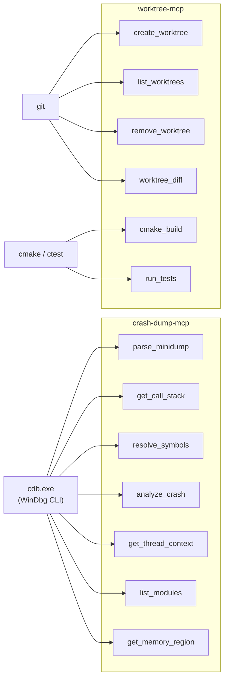
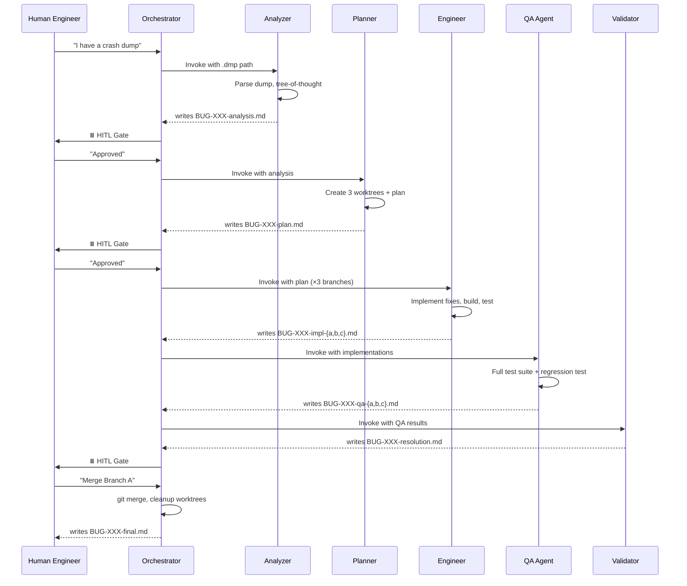

# Agentic Crash Dump SDLC — Architecture

This document describes the fully automated (with human-in-the-loop gates) crash dump
resolution system built for C++ game engine developers.

## System Overview



## Agent Roles

| Agent              | Mode File                        | Role                                           | Tools                  |
| ------------------ | -------------------------------- | ---------------------------------------------- | ---------------------- |
| Crash Analyzer     | `crash-analyzer.chatmode.md`     | Parse dumps, produce tree-of-thought diagnosis | crash-dump-mcp         |
| Crash Planner      | `crash-planner.chatmode.md`      | Design 3 parallel fix strategies               | worktree-mcp           |
| Crash Engineer     | `crash-engineer.chatmode.md`     | Implement fixes in isolated worktrees          | worktree-mcp, terminal |
| Crash QA           | `crash-qa.chatmode.md`           | Run tests, generate regression tests           | worktree-mcp, terminal |
| Crash Validator    | `crash-validator.chatmode.md`    | Present comparison + recommendation            | worktree-mcp (read)    |
| Crash Orchestrator | `crash-orchestrator.chatmode.md` | Coordinate pipeline, enforce HITL gates        | all                    |

## MCP Server Architecture



## File-Based Handoff Protocol

Agents communicate exclusively through markdown files in `docs/crash-reports/`:



## HITL Gates

| Gate | After Phase | Decision Options                        | Blocks         |
| ---- | ----------- | --------------------------------------- | -------------- |
| #1   | Analysis    | Approve / Reject / Revise               | Planning       |
| #2   | Planning    | Approve / Reject / Revise               | Implementation |
| #3   | Validation  | Merge X / Merge Y / Reject All / Revise | Merge          |

**Non-negotiable**: No gate may be bypassed, even if all automated checks pass.

## Directory Structure

```text
output/ea-cpp-games/
├── .github/
│   ├── chatmodes/
│   │   ├── crash-analyzer.chatmode.md
│   │   ├── crash-planner.chatmode.md
│   │   ├── crash-engineer.chatmode.md
│   │   ├── crash-qa.chatmode.md
│   │   ├── crash-validator.chatmode.md
│   │   └── crash-orchestrator.chatmode.md
│   ├── instructions/
│   │   ├── crash-dump-analysis.instructions.md
│   │   ├── crash-fix-engineering.instructions.md
│   │   └── resolution-tracking.instructions.md
│   └── prompts/
│       ├── crash-dump-intake.prompt.md
│       ├── tree-of-thought-analysis.prompt.md
│       ├── resolution-brief.prompt.md
│       ├── regression-test-generation.prompt.md
│       ├── fix-validation.prompt.md
│       └── resolution-report.prompt.md
├── .vscode/
│   └── mcp.json
├── tools/
│   ├── crash-dump-mcp/          ← MCP server (cdb.exe wrapper)
│   └── worktree-mcp/            ← MCP server (git worktree + cmake)
├── docs/
│   └── crash-reports/           ← All artifacts land here
└── tests/
    └── regression/              ← Permanent regression tests
```

## Technology Stack

| Component   | Technology                               | Purpose                      |
| ----------- | ---------------------------------------- | ---------------------------- |
| MCP Servers | TypeScript + `@modelcontextprotocol/sdk` | Tool abstraction layer       |
| Debugger    | cdb.exe (Windows Debugging Tools)        | Crash dump parsing           |
| Build       | CMake 3.28+ / Ninja                      | C++ compilation              |
| Test        | GoogleTest (ctest)                       | Validation                   |
| VCS         | Git worktrees                            | Parallel branch isolation    |
| Language    | C++20 (MSVC/GCC/Clang)                   | Target codebase              |
| Containers  | EASTL                                    | EA Standard Template Library |
