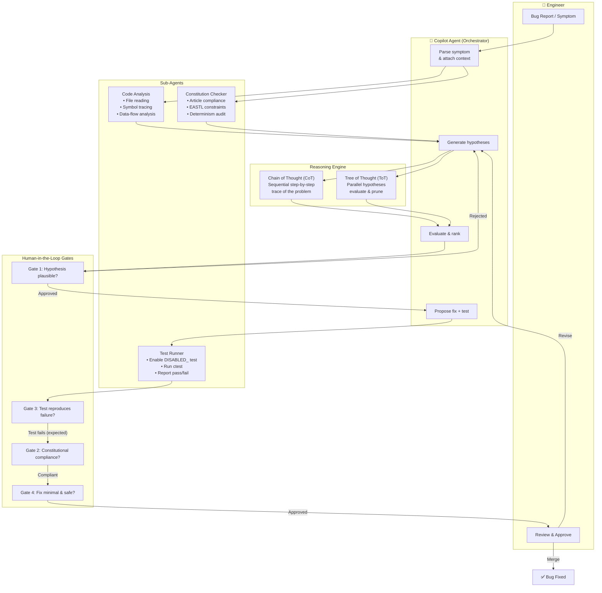
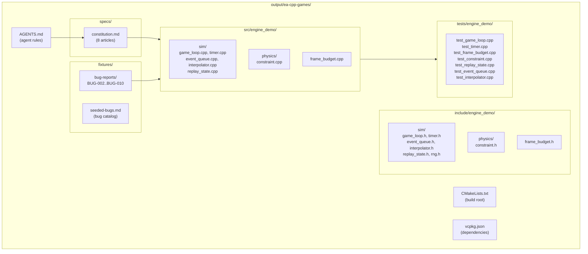
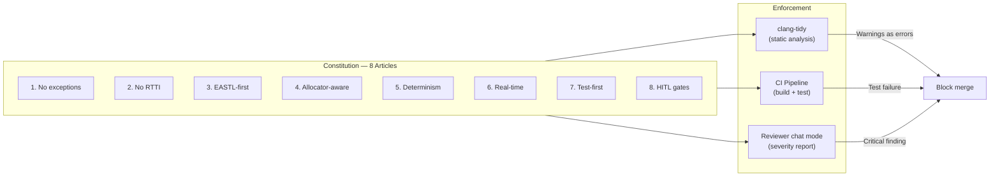

# Session 03 — C++ Game Logic Bug Resolution with AI Agentic Workflows

## Comprehensive Workshop Guide for Training Instructors

> **Audience:** Senior C++ game engineers
> **Duration:** 150–180 min (2–3 hour deep-dive)
> **Plan tier:** Business / Enterprise
> **Prerequisites:** Copilot Business seat, the `output/ea-cpp-games/` workspace built, ctest green

---

## Table of Contents

1. [AI Agent Resolving Logic Bugs — Demonstration (LIVE DEMO)](#section-1--ai-agent-resolving-logic-bugs--demonstration-20-min)
2. [Overall Logic Resolver Walkthrough](#section-2--overall-logic-resolver-walkthrough-15-min)
3. [Context Foundation](#section-3--context-foundation-25-min)
4. [Copilot AI Custom Agents](#section-4--copilot-ai-custom-agents-30-min)
5. [Tree of Thought (ToT) Deep-Dive](#section-5--tree-of-thought-tot-deep-dive-25-min)
6. [Human-in-the-Loop (HITL)](#section-6--human-in-the-loop-hitl-25-min)
7. [Appendix: Intermediate Developer Bridge](#section-7--appendix-intermediate-developer-bridge)
8. [New Copilot Capabilities: Loops, Skills & Cheaper Models](#section-8--new-copilot-capabilities-loops-skills--cheaper-models-static-guide-15-min)

> **Before you begin:** run the one-time [Pre-flight Setup](#pre-flight-setup-run-once-t-10-min) to confirm a green, seeded baseline.

---

## C++ Game Logic Bug Taxonomy

| Category                                       | Bug ID  | CWE     | Risk                         |
| ---------------------------------------------- | ------- | ------- | ---------------------------- |
| Numerical precision drift (float→double)       | BUG-002 | —       | Replay divergence            |
| Off-by-one in rolling windows                  | BUG-006 | —       | Telemetry skew               |
| Non-determinism (hash-map traversal)           | BUG-004 | —       | Replay divergence            |
| Type truncation/narrowing (uint64→uint32)      | BUG-005 | CWE-197 | Entropy loss                 |
| Signed integer overflow UB                     | BUG-007 | CWE-190 | Silent data corruption       |
| Uninitialized padding in memcmp                | BUG-008 | CWE-188 | Intermittent false negatives |
| Insufficient memory ordering (relaxed atomics) | BUG-009 | CWE-362 | Data race on ARM             |
| Signed-to-unsigned implicit promotion          | BUG-010 | CWE-195 | OOB read                     |

**False positives (triage targets):**

| ID     | Description                              | Why it's not a bug                                |
| ------ | ---------------------------------------- | ------------------------------------------------- |
| FP-001 | Seed function appears to truncate        | Narrow-widen via XOR; no data loss                |
| FP-002 | Constraint loop appears to read past end | Sentinel iteration; never reads buffer            |
| FP-003 | `m_ready` flagged as non-atomic          | Flag IS `std::atomic<bool>`; real bug is ordering |

---

## Pre-flight Setup (run once, T-10 min)

Run this **once** before the room arrives. It guarantees a clean, green, seeded baseline so
every demo and exercise starts from the same state. The fastest path is to hand the whole
check to the planner agent; a manual fallback follows.

> 🔧 **Setup prompt** — paste into the **Agent** panel with `@logic-bug-planner` selected:

```text
@logic-bug-planner
Prepare the Session-03 baseline in output/ea-cpp-games/. Do exactly this, no fixes:
1. Run ./reset_workshop.sh and report its final READY / NOT READY line verbatim.
2. Confirm `ctest --preset default-debug` is fully green.
3. Confirm all 10 DISABLED_ tests are still DISABLED_ (none enabled).
4. Confirm `git status --short` is clean (no seeded files modified).
Stop and report a PASS/FAIL checklist. Do not edit any source or test file.
```

> **Manual fallback** (if the agent is unavailable):
>
> ```bash
> cd output/ea-cpp-games
> ./reset_workshop.sh          # prints READY or NOT READY
> ctest --preset default-debug --output-on-failure
> git status --short           # expect empty output
> ```
>
> You are ready when `reset_workshop.sh` prints **READY**, ctest is green, and the working
> tree is clean. If it prints **NOT READY**, do not start — see
> [1d. Fallback Recovery Script](#1d-fallback-recovery-script).

---

## Section 1 — AI Agent Resolving Logic Bugs — Demonstration (~20 min)

**Format: LIVE DEMO** — no expected Copilot output inline. Trainer runs everything live.

## Learning Objectives

1. Witness the end-to-end agentic workflow resolving two real C++ logic bugs.
2. Understand the three reasoning techniques: Chain of Thought, Tree of Thought, Human-in-the-Loop.
3. See how layered context (constitution + AGENTS.md) shapes Copilot's analysis quality.

## 1a. Architecture Diagram — Agentic Logic Bug Resolver

> **Do:** Display this diagram on the projector before starting the demo.



## 1b. Three Reasoning Techniques

> **Say:** "Before we touch the keyboard, let's name the three reasoning patterns you'll see Copilot use today. These aren't marketing terms — they're from the research literature."

### Chain of Thought (CoT) — Wei et al., 2022

> **Say:** "CoT is linear reasoning: take a complex problem, decompose it into sequential steps, trace each step to a conclusion. Think: 'trace the accumulator value at frame 1800, step by step.'"

**When to use:** Single-hypothesis problems where the root cause is along one logical path.

### Tree of Thought (ToT) — Yao et al., 2023

> **Say:** "ToT explores multiple hypotheses in parallel — like three senior engineers in a room, each with a different theory. The model evaluates each branch, prunes the weak ones, and converges. Think: 'here are three possible causes of this non-determinism — let's evaluate each against the code.'"

**When to use:** Ambiguous symptoms where the root cause could be one of several subsystems.

### Human-in-the-Loop (HITL)

> **Say:** "HITL is the safety net. Copilot proposes; you validate, steer, or veto. In game-engine code, we never let AI autonomously merge changes to physics or replay systems. The four gates you see on the diagram are: hypothesis plausibility, constitutional compliance, test reproduction, and fix minimality."

**When to use:** Always, for safety-critical game code. The question is how many gates, not whether to gate.

---

## 1c. Live Demo Script

### Pre-demo checklist (T-5 min)

> 🔧 **Section Setup** — confirm the baseline and stage the files. Paste into the **Agent**
> panel with `@logic-bug-planner` selected:

```text
@logic-bug-planner
We are about to run the Section 1 live demo for BUG-002 and BUG-007 in
output/ea-cpp-games/. Verify readiness only — do NOT fix anything:
1. Confirm `ctest --preset default-debug` is green.
2. Confirm long_run_does_not_drift is still DISABLED_ in test_game_loop.cpp.
3. Confirm the optimized preset exists (build-optimized/) for the Demo B -O2 step.
Report PASS/FAIL per item. Then list the four files to open in split editors:
game_loop.cpp, test_game_loop.cpp, timer.cpp, timer.h.
```

> **Do:** Open these files in split editor groups:
>
> - Left: `src/engine_demo/sim/game_loop.cpp`
> - Right: `tests/engine_demo/test_game_loop.cpp`
>
> All build and test commands in this session run from the `output/ea-cpp-games/` workspace —
> that is where `CMakePresets.json` lives, so `cmake`/`ctest --preset` fail from the repo root.

> **Manual fallback:**
>
> ```bash
> cd output/ea-cpp-games
> ctest --preset default-debug --output-on-failure
> ```
>
> **Watch for:** All DISABLED\_ tests are still disabled. The green baseline must be confirmed before starting.

> ⚠️ **Common pitfalls** (read once, avoid all session):
>
> - **Wrong directory.** Every `cmake`/`ctest --preset` command needs `cd output/ea-cpp-games`
>   first. From the repo root the presets are invisible and the command fails.
> - **Forgetting to rebuild after un-`DISABLED_`-ing a test.** `ctest` does **not** compile.
>   Always `cmake --build --preset …` before `ctest`, or you test a stale binary.
> - **Over-broad test filters.** Use the precise binary name (`-R test_game_loop`), not a
>   substring like `-R long_run` — `ctest` filters on the test **binary**, not the GTest case.

---

### Demo Part A: BUG-002 — Float Accumulator Drift (~10 min)

> **Say:** "Let's start with a bug that never crashes, never throws, and never appears in any log. A long replay diverges after 30 seconds. The only symptom is: the substep count oscillates between 0 and 1 instead of being a steady 1. Let's see if Copilot can find the root cause."

#### Step 1: Observe — Ask Copilot to analyze

> **Do:** Open the Copilot **Ask** panel. Type this prompt exactly:

```text
#file:output/ea-cpp-games/include/engine_demo/sim/game_loop.h
#file:output/ea-cpp-games/src/engine_demo/sim/game_loop.cpp
#file:output/ea-cpp-games/specs/constitution.md

A long replay diverges from a reference run after ~30 simulated seconds at 60 FPS.
The substep count returned by advance() oscillates between 0 and 1 instead of being
a steady 1. Identify the root cause. Cite which constitutional article is violated.
```

> **Watch for:** Copilot identifies `float m_accumulator_seconds` as the root cause and cites Article 5 (determinism). If Copilot does not cite Article 5, prompt: "Which constitutional article does this violate?"

> **Say:** "Notice Copilot didn't just say 'use double.' It traced the narrowing path — `static_cast<float>(delta_seconds)` — and connected it to the constitutional mandate. That's the context layer doing its job."

#### Step 2: Reproduce — Enable the regression test

> **Do:** In the **Ask** panel:

```text
#file:output/ea-cpp-games/tests/engine_demo/test_game_loop.cpp

Re-enable the DISABLED_long_run_does_not_drift test by removing the DISABLED_ prefix.
Explain in one sentence why this test will fail.
```

> **Do:** Apply the edit (remove `DISABLED_` prefix). Rebuild so GoogleTest registers the
> newly enabled test, then run (from `output/ea-cpp-games/`):

```bash
cd output/ea-cpp-games
cmake --build --preset default-debug
ctest --preset default-debug --output-on-failure -R test_game_loop
```

> **Note:** `ctest` does **not** compile. Skipping the rebuild after removing `DISABLED_`
> yields `No tests were found!!!` because the renamed test was never compiled in.

> **Note:** ctest registers tests **per binary**, not per GoogleTest case. The `-R` filter
> matches the binary name (`test_game_loop`), so the whole timer-loop binary runs and the
> `long_run` case fails inside it. A case-name filter like `-R long_run` matches nothing.

> **Watch for:** The test fails with `substep drift at frame 3599` and `cumulative substep drift over 3600 frames` — the float loop fires 2159 substeps where the inline double reference fires 2160 over 36 simulated seconds.

> **Say:** "Phase 2 complete — we have a red test. This is the test-first discipline: never fix what you can't reproduce."

#### Step 3: Fix — Apply the CoT-guided fix

> **Do:** Switch to **Edit** mode. Type:

```text
#file:output/ea-cpp-games/include/engine_demo/sim/game_loop.h
#file:output/ea-cpp-games/src/engine_demo/sim/game_loop.cpp

Promote m_accumulator_seconds from float to double. Remove now-redundant
static_cast<float> calls. Constitutional articles 1, 2, and 5 must hold.
```

> **Watch for:** The diff changes the member type in the header and drops the casts in the `.cpp`. If Copilot leaves any casts, ask: "Are any casts now redundant?"

> **Do:** Accept the edit, rebuild, then rerun (from `output/ea-cpp-games/`):

```bash
cd output/ea-cpp-games
cmake --build --preset default-debug
ctest --preset default-debug --output-on-failure -R test_game_loop
```

> **Watch for:** Green. The test passes.

> **Say:** "Four minutes. Root cause identified, test reproducing, fix verified. That's the CoT workflow: observe → reproduce → bisect → fix → verify."

> **What good looks like** (facilitator safety net — do not read aloud). A strong BUG-002
> resolution will:
>
> - Name the **root cause precisely**: a `float` accumulator loses precision; `1.0/60.0` is
>   not representable and rounding error compounds over ~1800 frames.
> - **Trace the value** to the `float` accumulator/cast where precision is lost — not just
>   "use double somewhere."
> - **Cite Article 5 (Determinism)** as the constitution rule the bug violates.
> - Propose the **minimal fix**: widen the accumulator to `double` — a roughly two-file diff
>   (source + the re-enabled test). No new guard, no `std::`.
>
> If Copilot offers a `float` epsilon tolerance instead of widening the type, that is the
> teachable miss — steer back to "change the type, not the test."

> 🔧 **Reset before Demo B** — Demo B must start from the clean seeded baseline (BUG-002
> re-`DISABLED_`, the `float`→`double` fix reverted). Paste into the **Agent** panel:

```text
@logic-bug-planner
Reset output/ea-cpp-games/ to the clean seeded baseline before the next demo:
1. Run ./reset_workshop.sh.
2. Report its final READY / NOT READY line verbatim.
3. Confirm long_run_does_not_drift is DISABLED_ again and ctest --preset default-debug is green.
Do not apply or keep any fix.
```

> **Manual fallback:** from `output/ea-cpp-games/`, run `git restore tests/engine_demo
src/engine_demo include/engine_demo` then `cmake --build --preset default-debug`.

---

### Demo Part B: BUG-007 — Signed Overflow UB (~10 min)

> **Say:** "Now let's look at a nastier class of bug — one that works in Debug but breaks in Release. This is the kind of bug that ships to certification."

#### Step 1: Set the stage

> **Do:** Open `src/engine_demo/sim/timer.cpp` and `include/engine_demo/sim/timer.h` side by side.

> **Say:** "Read the overflow guard on line 32 of timer.cpp: `if (m_elapsed_ms + delta_ms > m_elapsed_ms)`. Looks defensive, right? It's checking for overflow. Raise your hand if you'd approve this in code review."

> **Watch for:** Most hands go up. This is the teaching moment.

#### Step 2: Ask Copilot to analyze

> **Do:** In the **Ask** panel:

```text
#file:output/ea-cpp-games/include/engine_demo/sim/timer.h
#file:output/ea-cpp-games/src/engine_demo/sim/timer.cpp
#file:output/ea-cpp-games/specs/constitution.md

This timer has a "safety guard" for overflow. Analyze whether this guard is
effective at -O2 optimization level. Explain what the C++ standard says about
signed integer overflow and how a conforming optimizer treats this code.
```

> **Watch for:** Copilot explains that signed overflow is UB per [expr.pre]/4, and the optimizer legally reasons that `(x + positive) > x` is always true → branch is unconditional → guard is elided.

> **Say:** "This is why 'it works in Debug' is never validation. The compiler is doing exactly what the standard permits."

#### Step 3: Reproduce

> **Do:** Enable `DISABLED_overflow_guard_not_elided` in `tests/engine_demo/test_timer.cpp`
> (remove the `DISABLED_` prefix — it is on line 46).

> **Do:** Configure **and build** the optimized (-O2) preset, where the elision actually
> bites. The `build-optimized/` tree may not exist yet, so the `cmake --preset` configure
> step is required the first time (from `output/ea-cpp-games/`):

```bash
cd output/ea-cpp-games
cmake --preset optimized          # first run only: creates build-optimized/
cmake --build --preset optimized  # compiles the now-enabled test
ctest --preset optimized --output-on-failure -R test_timer
```

> **Do:** For contrast, rebuild and run the same test in the Debug (-O0) preset — it passes
> by accident because the guard is not elided:

```bash
cd output/ea-cpp-games
cmake --build --preset default-debug
ctest --preset default-debug --output-on-failure -R test_timer
```

> **Note:** `ctest` never compiles. Two failure modes if you skip the build steps:
> `No tests were found!!!` (the `DISABLED_` test was never compiled in), or stale results
> from a prior build. Always `cmake --build` the preset before its `ctest` run.

> **Note:** ctest registers tests **per binary**, so the `-R` filter is the binary name
> (`test_timer`), not the GoogleTest case (`overflow_guard_not_elided`). The whole
> `test_timer` binary runs (4 cases); the overflow case fails inside it at -O2. A filter
> like `-R overflow` matches nothing and reports `No tests were found!!!`.

> **Watch for:** `optimized` FAILS (the signed-overflow guard is deleted at -O2); `default-debug` PASSES (the guard runs at -O0). That contrast is the entire lesson — "works in Debug" is not validation.

#### Step 4: Fix

> **Do:** In **Edit** mode:

```text
#file:output/ea-cpp-games/include/engine_demo/sim/timer.h
#file:output/ea-cpp-games/src/engine_demo/sim/timer.cpp

Change m_elapsed_ms to std::uint64_t. Remove the fragile overflow guard entirely —
unsigned wraparound is defined behavior and takes ~584 million years at 1ms resolution.
Update tick() return type and elapsed_ms() accordingly. Constitutional articles 1, 5 must hold.
```

> **Watch for:** Copilot changes the type in the header, updates the function signatures, and removes the UB guard.

> **Do:** Accept the edit, rebuild the optimized preset, then rerun to confirm green (from `output/ea-cpp-games/`):

```bash
cd output/ea-cpp-games
cmake --build --preset optimized
ctest --preset optimized --output-on-failure -R test_timer
```

> **Watch for:** Green at -O2. The unsigned type makes wraparound defined, so no guard is needed and nothing is elided.

> **Say:** "The fix isn't 'make the guard better' — it's 'change the type so no guard is needed.' Copilot suggested the same fix the standard recommends."

> **What good looks like** (facilitator safety net — do not read aloud). A strong BUG-007
> resolution will:
>
> - Identify **signed-overflow undefined behavior** per `[expr.pre]/4`: the guard
>   `m_elapsed_ms + delta_ms > m_elapsed_ms` assumes wraparound the standard forbids.
> - Explain the **optimizer elision**: at `-O2` the compiler proves the comparison is always
>   true for signed types and **deletes the branch** — which is why it passes at `-O0` and
>   fails at `-O2`.
> - Contrast the two presets explicitly (`default-debug` green, `optimized` red) as the
>   reproduction, not a debugger.
> - Propose the **type-level fix**: make `m_elapsed_ms` a `uint64_t` (defined wraparound) and
>   **drop the now-useless guard** — not "rewrite the guard."
>
> If Copilot suggests `-fwrapv` or a bigger guard, name it as treating the symptom; the
> standard-aligned fix is the unsigned type.

---

## 1d. Fallback Recovery Script

> **If the live demo fails** (Copilot gives unhelpful output, network issues, etc.):

1. **Show the source files directly.** Walk through `game_loop.cpp` line by line and ask the audience to spot the `float` vs. `double` issue. This takes ~3 minutes.

2. **Use prepared screenshots.** Before the session, capture screenshots of a successful Copilot interaction for both BUG-002 and BUG-007. Store them in `sessions/03-logic-bugs/fallback-screenshots/`.

3. **Walk the math on a whiteboard:**
   - BUG-002: "Float has 24 bits of mantissa. 1/60 ≈ 0.0166667. After 1800 additions, the accumulated error exceeds the step size."
   - BUG-007: "Signed overflow is UB. The compiler sees `x + positive > x` and says: 'this is always true for signed integers because overflow can't happen.' The branch is deleted."

4. **Pre-record a backup GIF.** Run the demo before the session and record a terminal GIF using `asciinema` or similar. Play it if live execution fails.

5. **Pivot to audience participation:** Open the source file and ask: "Who can write the failing test for BUG-002 in under 3 lines?" Use audience answers to drive the discussion.

---

## Section 2 — Overall Logic Resolver Walkthrough (~15 min)

**Format: STATIC GUIDE** — expected Copilot output included inline.

## Learning Objectives — Section 2

1. Navigate the project structure confidently.
2. Build, run, and interpret test results.
3. Understand the `DISABLED_` prefix pattern and test-first workflow.

> 🔧 **Section Setup** — paste into the **Agent** panel to open the files this section walks
> through:

```text
Open these files from output/ea-cpp-games/ in the editor so I can follow Section 2:
- CMakePresets.json
- tests/engine_demo/test_game_loop.cpp
- src/engine_demo/sim/game_loop.cpp
Then summarize, in 3 bullets, what the default-debug preset builds and where test
binaries land. Do not modify anything.
```

## 2a. Directory Structure



## 2b. File System Walkthrough

### Prompt: Explore the project structure

```text
Describe the directory structure of the output/ea-cpp-games/ workspace.
What is the role of each top-level directory? Where do the constitutional
rules live? Where are the seeded bugs cataloged?
```

> ⚠️ Model-drift note: Exact output may vary across Copilot model updates.
> The structure and reasoning pattern should match.

```text
The workspace follows a standard C++20 game-engine layout:

• **AGENTS.md** — Agent-scoped rules: no std:: containers, no exceptions, no RTTI,
  EASTL-first, allocator-aware. This file overrides the repo-root AGENTS.md when
  operating inside output/ea-cpp-games/.

• **specs/constitution.md** — Eight non-negotiable articles governing all code:
  1. No exceptions  2. No RTTI  3. EASTL-first  4. Allocator-aware
  5. Determinism  6. Real-time budgets  7. Test-first  8. HITL gates

• **fixtures/seeded-bugs.md** — Catalog of 10 intentionally seeded defects (BUG-001
  through BUG-010) with subsystem, class, and session assignment.

• **fixtures/bug-reports/** — Detailed per-bug reports with reproduction steps,
  root cause hypotheses, and suggested fixes.

• **include/engine_demo/** — Public headers organized by subsystem (sim/, physics/).

• **src/engine_demo/** — Implementation files. Each bug's source is annotated with
  a comment block explaining the seeded defect.

• **tests/engine_demo/** — GTest files. Regression tests for seeded bugs use the
  DISABLED_ prefix and are enabled during the workshop.

• **CMakeLists.txt / CMakePresets.json** — Build system using CMake presets.
  Build with: cmake --preset default-debug && cmake --build --preset default-debug
```

## 2c. Build and Test Cycle

> All commands below run from the `output/ea-cpp-games/` workspace (where `CMakePresets.json`
> lives). Running `cmake`/`ctest --preset` from the repo root fails with
> `Could not read presets ... File not found: CMakePresets.json`.

### Build commands

```bash
cd output/ea-cpp-games
cmake --preset default-debug
cmake --build --preset default-debug
```

### Run all tests

```bash
cd output/ea-cpp-games
ctest --preset default-debug --output-on-failure
```

### Prompt: Understand the DISABLED\_ pattern

```text
In the test files under tests/engine_demo/, several test names start with DISABLED_.
What does this prefix do in GoogleTest? How do we enable them?
```

> ⚠️ Model-drift note: Exact output may vary across Copilot model updates.
> The structure and reasoning pattern should match.

```text
In GoogleTest, a test name prefixed with `DISABLED_` is compiled but not executed
by default. This is used when:

1. The test documents a known regression that hasn't been fixed yet.
2. The test is the "failing state" artifact for a workshop or demo.
3. The test requires specific conditions (e.g., TSAN, -O2) to reproduce.

To enable a specific disabled test:
  - Remove the DISABLED_ prefix from the test name and rebuild.
  - Or run: ctest --gtest_also_run_disabled_tests

In this workshop, each DISABLED_ test corresponds to a seeded bug. The workflow is:
1. Enable the test (remove DISABLED_ prefix).
2. Run ctest — observe the failure.
3. Apply the fix.
4. Run ctest — observe the pass.

This enforces the constitutional Article 7 mandate: test-first workflow.
```

## 2d. Test Inventory

| Test File               | Bug     | DISABLED\_ Test Name                                         | What it proves                                            |
| ----------------------- | ------- | ------------------------------------------------------------ | --------------------------------------------------------- |
| `test_game_loop.cpp`    | BUG-002 | `DISABLED_long_run_does_not_drift`                           | Float loop misses a substep vs. double ref (2159 vs 2160) |
| `test_frame_budget.cpp` | BUG-006 | `DISABLED_first_sample_is_not_double_counted_on_warmup`      | Rolling window miscounts on warm-up                       |
| `test_constraint.cpp`   | BUG-004 | `DISABLED_solve_is_deterministic_across_construction_orders` | Hash-map traversal order breaks determinism               |
| `test_timer.cpp`        | BUG-007 | `DISABLED_overflow_guard_not_elided`                         | Signed overflow guard deleted at -O2                      |
| `test_replay_state.cpp` | BUG-008 | `DISABLED_padding_does_not_affect_comparison`                | memcmp reads uninitialized padding                        |
| `test_event_queue.cpp`  | BUG-009 | `DISABLED_consumer_observes_complete_payload`                | Relaxed ordering → data race on ARM                       |
| `test_interpolator.cpp` | BUG-010 | `DISABLED_unstarted_does_not_read_oob`                       | -1 → SIZE_MAX defeats bounds check                        |

---

## Section 3 — Context Foundation (~25 min)

**Format: STATIC GUIDE** — expected Copilot output included inline.

## Learning Objectives — Section 3

1. Understand how AGENTS.md, constitution.md, and bug reports function as context layers.
2. See concrete quality differences between zero-context, partial-context, and full-context prompts.
3. Appreciate why EASTL vs. std:: constraints matter for Copilot accuracy.

> 🔧 **Section Setup** — paste into the **Agent** panel to stage the three context artifacts:

```text
Open these context files from output/ea-cpp-games/ so I can compare prompts in Section 3:
- AGENTS.md
- specs/constitution.md
- fixtures/bug-reports/ (list the BUG-004 report if present)
Confirm each opened, then wait. Do not analyze or edit yet.
```

## 3a. Context Artifact Roles

| Artifact                          | Role               | Key Content                                                      |
| --------------------------------- | ------------------ | ---------------------------------------------------------------- |
| `AGENTS.md`                       | Agent-scoped rules | No std:: containers, no exceptions, EASTL-first, allocator-aware |
| `specs/constitution.md`           | Ground truth spec  | 8 articles: determinism, real-time budgets, test-first           |
| `fixtures/seeded-bugs.md`         | Bug catalog        | 10 bugs with subsystem, class, session assignment                |
| `fixtures/bug-reports/BUG-XXX.md` | Per-bug detail     | Reproduction, root cause, suggested fix                          |

### Prompt: What does AGENTS.md tell Copilot?

```text
#file:output/ea-cpp-games/AGENTS.md

Summarize the hard rules in this AGENTS.md. How do they constrain the code
Copilot should generate for this workspace?
```

> ⚠️ Model-drift note: Exact output may vary across Copilot model updates.
> The structure and reasoning pattern should match.

```text
AGENTS.md establishes eight hard rules for this workspace:

1. **No std:: containers** — Use EASTL equivalents (eastl::vector, eastl::string, etc.).
   Only allocation-free std:: headers allowed (<cstdint>, <type_traits>, etc.).
2. **No exceptions** — Compiled with -fno-exceptions. Use status enums or eastl::expected.
3. **No RTTI** — No dynamic_cast, no typeid.
4. **Allocator-aware** — Every container takes an explicit allocator.
5. **[[nodiscard]]** on factories and status-returning functions.
6. **noexcept** on move operations and swap.
7. **Determinism** — eastl::mt19937 with explicit seeds; double accumulators; no
   pointer-keyed hash maps in sim paths.
8. **Real-time** — No allocation in inner loops; pool/arena up front.

These rules mean Copilot should NEVER generate std::vector, try/catch, or
dynamic_cast in this workspace. Any suggestion that includes these is incorrect
and should be rejected at the HITL gate.
```

## 3b. Three-Version Context Comparison (BUG-009)

This is the key teaching moment: the same bug analyzed with three levels of context.

### Version A: NO context files attached

```text
The event_slot class has a memory ordering bug. The publish() function
writes a payload and then sets m_ready with memory_order_relaxed. The
consumer reads m_ready with memory_order_relaxed and then reads the payload.
Is this correct?
```

> ⚠️ Model-drift note: Exact output may vary across Copilot model updates.
> The structure and reasoning pattern should match.

```text
Using memory_order_relaxed for both the producer and consumer is potentially
problematic. memory_order_relaxed only guarantees atomicity — it does not
establish a happens-before relationship.

You might want to consider using memory_order_release for the store and
memory_order_acquire for the load. However, whether this is necessary depends
on your specific use case and target platform.

On x86, the Total Store Order (TSO) memory model provides implicit ordering
that may mask this issue, but portable code should use explicit ordering.
```

**Quality assessment:** Generic advice. No mention of EASTL, no constitutional citation, hedged language ("might want to consider"), no specific fix code.

---

### Version B: ONLY source file attached

```text
#file:output/ea-cpp-games/src/engine_demo/sim/event_queue.cpp

Analyze the memory ordering in this event_slot implementation. Is the use of
memory_order_relaxed correct for an SPSC producer-consumer pattern?
```

> ⚠️ Model-drift note: Exact output may vary across Copilot model updates.
> The structure and reasoning pattern should match.

````text
**Bug found: Insufficient memory ordering in SPSC event slot.**

In `publish()`, the payload write (the field-by-field copy of `payload.timestamp`,
`payload.event_type`, and `payload.value` into `m_payload`) is a non-atomic store.
The subsequent `m_ready.store(true, memory_order_relaxed)` does NOT fence this write.

On ARM/Apple Silicon (weakly ordered):
- The processor may reorder the `m_payload` store AFTER the `m_ready` store.
- The consumer sees `m_ready == true` but reads stale `m_payload` data.

On x86 (TSO):
- Hardware provides implicit store→store ordering. The bug is masked.

**Fix:** Change to release/acquire ordering:
```cpp no-compile
// Producer
m_ready.store(true, std::memory_order_release);

// Consumer
if (m_ready.load(std::memory_order_acquire)) { ... }
```

This is a data race per [intro.races] and undefined behavior.

````

**Quality assessment:** Accurate technical analysis. Identifies the correct root cause, gives platform-specific reasoning. But no mention of constitutional compliance, no EASTL context, no awareness of FP-003.

---

### Version C: AGENTS.md + constitution + source file

```text
#file:output/ea-cpp-games/AGENTS.md
#file:output/ea-cpp-games/specs/constitution.md
#file:output/ea-cpp-games/src/engine_demo/sim/event_queue.cpp

Analyze the memory ordering in this event_slot implementation. Is it correct
for an SPSC producer-consumer pattern? Cite any constitutional violations.
```

> ⚠️ Model-drift note: Exact output may vary across Copilot model updates.
> The structure and reasoning pattern should match.

````text
**Critical Bug: BUG-009 — Insufficient memory ordering in SPSC event slot.**

**Constitutional violations:**
- **Article 5 (Determinism):** Behavior differs across architectures. On x86 (TSO),
  the SPSC pattern works by hardware ordering. On ARM/Apple Silicon, the consumer
  may read stale payload data. Cross-platform determinism is violated.
- **Article 6 (Real-time):** The lockless ring buffer handoff pattern requires
  correct memory ordering on ALL target platforms to guarantee data integrity.

**Root cause:**
`publish()` uses `memory_order_relaxed` on `m_ready.store()`. Per ISO C++
[atomics.order], relaxed ordering provides ONLY atomicity — it does NOT establish
a happens-before relationship between the non-atomic `m_payload` write and the
consumer's read.

**Important: This is NOT FP-003.** `m_ready` IS correctly declared as
`std::atomic<bool>`. The flag is atomic. The bug is the ORDERING GUARANTEE,
not the atomicity of the flag.

**Fix (EASTL-compliant, no std:: containers needed):**
```cpp no-compile
// Producer — release ensures all prior writes (including m_payload) are visible
m_ready.store(true, std::memory_order_release);

// Consumer — acquire ensures all writes before the matching release are visible
if (m_ready.load(std::memory_order_acquire)) {
    out = m_payload;  // guaranteed to see complete data
    m_ready.store(false, std::memory_order_relaxed);  // reset can be relaxed
    return true;
}
```

**Validation:** The reset() can remain relaxed because it runs in single-threaded
teardown context — no synchronization needed.

````

**Quality assessment:** Full constitutional citation, correct FP-003 disambiguation, platform-specific analysis, EASTL-aware fix. This is the quality level you want.

### Instructor Talking Point

> **Say:** "Version C is dramatically better — not because the model is 'smarter,' but because the context constrains the solution space. The constitution gives Copilot a rubric. AGENTS.md prevents std:: suggestions. The combination eliminates hedge language and surfaces the false-positive distinction that versions A and B miss entirely."

### Scoring Rubric — Grade the Three Versions

Use this to make the quality jump objective. Score each prompt's output 0 (absent) or 1
(present) on five criteria; the expected totals are in the right column.

| Criterion                                                    | Zero-context (A) | Partial (B) | Full (C) |
| ------------------------------------------------------------ | ---------------- | ----------- | -------- |
| Names the **real** root cause (not a guess)                  | 0                | 1           | 1        |
| Is **platform/standard-specific** (cites behavior precisely) | 0                | 0           | 1        |
| **Cites a constitution article** by number                   | 0                | 0           | 1        |
| Disambiguates the **false positive** (e.g., FP-002/FP-003)   | 0                | 0           | 1        |
| Proposes an **EASTL-aware** fix (no `std::`)                 | 0                | 1           | 1        |
| **Expected total**                                           | **0–1**          | **2–3**     | **5**    |

> **Teaching point:** the jump from B to C is not model quality — it is the constitution and
> AGENTS.md collapsing the solution space. Show learners that the missing points in A and B
> map one-to-one to a missing context file.

## 3c. EASTL vs. std:: — Why Context Matters

### Prompt: Why does this codebase use EASTL?

```text
#file:output/ea-cpp-games/AGENTS.md
#file:output/ea-cpp-games/specs/constitution.md

Explain why this codebase uses EASTL instead of the C++ standard library.
What problems does std:: cause in a game-engine context?
```

> ⚠️ Model-drift note: Exact output may vary across Copilot model updates.
> The structure and reasoning pattern should match.

```text
EASTL (Electronic Arts Standard Template Library) is used because the C++
standard library has several properties that conflict with game-engine requirements:

1. **Allocator model:** std::allocator is stateless and uses global operator new.
   Game engines need per-frame arenas, pool allocators, and explicit lifetime
   control. EASTL containers accept explicit allocator instances at construction
   (Article 4).

2. **Exception handling:** std:: containers throw on allocation failure (std::bad_alloc).
   Game engines compile with -fno-exceptions (Article 1). EASTL containers use
   status returns.

3. **RTTI dependency:** Some std:: facilities require RTTI (e.g., std::any,
   std::function in some implementations). Game engines compile with -fno-rtti
   (Article 2).

4. **Binary size:** std:: template instantiations can bloat binary size. EASTL
   is designed for size-constrained console/mobile platforms.

5. **Determinism:** std::unordered_map iteration order is implementation-defined
   and can vary across standard library versions. EASTL provides deterministic
   hash containers when needed (Article 5).

Without AGENTS.md providing this context, Copilot would default to std:: suggestions
that violate Articles 1-4 and require manual correction.
```

---

## Section 4 — Copilot AI Custom Agents (~30 min)

**Format: STATIC GUIDE** — expected Copilot output included inline.

## Learning Objectives — Section 4

1. Build a custom Copilot agent mode from scratch.
2. Define agent instructions, tools, and workflow for systematic bug resolution.
3. Test the agent against real seeded defects.

> 🔧 **Section Setup** — confirm the agent is installed and the baseline is green. Paste into
> the **Agent** panel with `@logic-bug-planner` selected:

```text
@logic-bug-planner
Self-check before Section 4: confirm you are loaded and report (a) which constitution
articles you enforce, (b) the observe→reproduce→fix→verify gate you follow, and
(c) that `ctest --preset default-debug` in output/ea-cpp-games/ is green. Do not fix anything.
```

## 4a. Complete `logic-bug-planner.agent.md`

> **Say:** "Instead of typing the same context attachments and workflow instructions into every prompt, we encode them into a custom agent mode. This is the 'logic-bug-planner' — a specialized Copilot agent that knows the constitution, knows the DISABLED\_ pattern, and follows a strict observe→reproduce→fix→verify workflow."

Create file `.github/agents/logic-bug-planner.agent.md`:

````markdown
---
name: logic-bug-planner
description: >
  Systematic logic bug resolver for the engine_demo C++20 game-engine workspace.
  Follows observe → reproduce → fix → verify workflow with constitutional compliance
  checks at every step.
tools:
  - codebase
  - terminal
  - editFile
---

# Logic Bug Planner

You are an expert C++20 game-engine debugger working in the `output/ea-cpp-games/`
workspace. You resolve logic bugs using a strict four-phase workflow.

## Context (always loaded)

- **AGENTS.md** at `output/ea-cpp-games/AGENTS.md` — workspace rules.
- **Constitution** at `output/ea-cpp-games/specs/constitution.md` — 8 non-negotiable articles.
- **Bug catalog** at `output/ea-cpp-games/fixtures/seeded-bugs.md`.

## Hard constraints

1. **No std:: containers** in committed code. Use EASTL equivalents.
2. **No exceptions, no RTTI.** Compiled with `-fno-exceptions -fno-rtti`.
3. **Allocator-aware.** Every container takes an explicit `engine_demo::allocator`.
4. **Test-first.** Always enable the DISABLED\_ regression test BEFORE applying the fix.
5. **HITL gates.** Pause for human approval between diagnosis and fix.

## Four-phase workflow

### Phase 1: OBSERVE

- Read the bug report from `fixtures/bug-reports/BUG-XXX.md`.
- Read the source file and its header.
- State the symptom in one sentence.

### Phase 2: REPRODUCE

- Find the DISABLED\_ regression test in `tests/engine_demo/`.
- Enable it by removing the DISABLED\_ prefix.
- Run: `ctest --preset default-debug --output-on-failure -R <test_name>`
- Report: test passes or fails, and why.

### Phase 3: FIX

- Propose the minimal fix that resolves the bug.
- Cite which constitutional articles are satisfied.
- Apply the fix using editFile.

### Phase 4: VERIFY

- Rerun the regression test.
- Confirm it passes.
- Run the full test suite to check for regressions.

## Output format

For each phase, output:

```text
## Phase N: <PHASE_NAME>
**Action:** <what you did>
**Result:** <what happened>
**Constitutional compliance:** <articles checked>
```
````

## 4b. Invoking the Agent — BUG-004 (Non-determinism)

### Prompt

```text
@logic-bug-planner Resolve BUG-004 — the constraint solver depends on hash-map
iteration order, causing non-deterministic replay divergence.
```

> ⚠️ Model-drift note: Exact output may vary across Copilot model updates.
> The structure and reasoning pattern should match.

```text
## Phase 1: OBSERVE

**Action:** Read `fixtures/bug-reports/BUG-004.md` and `src/engine_demo/physics/constraint.cpp`.

**Result:** The constraint solver's `solve()` method iterates constraints in vector order
(deterministic) but reads body state via `m_bodies.find(id)` on an `eastl::hash_map`.
Hash-map traversal order is not guaranteed across runs. When constraint projections read
body state in different orders, the solver converges to slightly different positions
(O(1e-9) per iteration, accumulating across frames).

**Symptom:** Two solvers with identical bodies and constraints inserted in opposite orders
produce divergent positions after 8 iterations.

**Constitutional compliance:** Article 5 (determinism) is violated — iteration order over
`eastl::hash_map` is not deterministic.

---

## Phase 2: REPRODUCE

**Action:** Enable `DISABLED_solve_is_deterministic_across_construction_orders` in
`tests/engine_demo/test_constraint.cpp`.

**Result:** The test is currently a stub (`SUCCEED()`). To properly reproduce, the test
needs to:
1. Build two solvers with identical bodies inserted in opposite orders.
2. Add identical constraints to both.
3. Run solve(8) on both.
4. Assert exact-match positions.

**HITL Gate:** The existing test stub needs to be replaced with a proper reproduction
test. Shall I write the full test?

---

## Phase 3: FIX (pending human approval)

**Proposed fix:**
1. Sort constraints once at insertion by `(min(a, b), max(a, b))`.
2. Build a deterministic dense index of bodies at solver setup (e.g., `eastl::vector<body*>`
   sorted by body ID).
3. In `solve()`, read body state through the dense index instead of hash-map lookup.

**Constitutional compliance:**
- Article 3 (EASTL-first): Using `eastl::vector` for the dense index. ✓
- Article 4 (Allocator-aware): Dense index uses `m_alloc`. ✓
- Article 5 (Determinism): Sorted constraints + dense index → deterministic. ✓
- Article 6 (Real-time): Dense index is built once at setup, not per-frame. ✓

**Waiting for human approval before applying.**

---

## Phase 4: VERIFY (pending)

Will run after fix is approved and applied:
- `ctest --preset default-debug --output-on-failure -R test_constraint`
- Full suite: `ctest --preset default-debug --output-on-failure`
```

## 4c. Exercise: Build the Agent from Scratch

**Time:** 15 min

### Step 1: Review the agent file

> **Do:** Open the existing `.github/agents/logic-bug-planner.agent.md` and confirm its content matches Section 4a. (The file ships with the workspace — review and confirm it rather than recreating it.)

### Step 2: Test with a simple bug

```text
@logic-bug-planner Analyze BUG-006 — the frame_budget rolling window double-counts
on warm-up. Walk through all four phases.
```

> ⚠️ Model-drift note: Exact output may vary across Copilot model updates.
> The structure and reasoning pattern should match.

````text
## Phase 1: OBSERVE

**Action:** Read `src/engine_demo/frame_budget.cpp` and `include/engine_demo/frame_budget.h`.

**Result:** `record_sample()` writes at `m_index` and post-increments. `rolling_average()`
iterates `[0, m_count)` — but on warm-up, slots beyond the written range contain stale
zeros. The average is diluted by unwritten slots.

**Symptom:** After recording samples [2.0, 4.0, 6.0] in a window of size 4, the rolling
average should be (2+4+6)/3 = 4.0, but the code may include a stale zero from slot 3.

---

## Phase 2: REPRODUCE

**Action:** Enable `DISABLED_first_sample_is_not_double_counted_on_warmup` in
`tests/engine_demo/test_frame_budget.cpp`.

**Result:** Running `ctest -R test_frame_budget` — the test PASSES as seeded: a single sample of
10.0 yields `rolling_average() == 10.0`, because `m_count` is 1 and only the written
slot is summed (the backing array is zero-initialized). BUG-006 does **not** reproduce
in the seeded tree — this is a deliberate *non-reproducing* hypothesis. To make it fail
you would first reseed `rolling_average()` to iterate the full fixed window instead of
`[0, m_count)`.

---

## Phase 3: FIX

**Proposed fix:** Change `rolling_average()` to iterate only the most-recent `m_count`
samples starting from `(m_index - m_count + m_window_size) % m_window_size`:

```cpp no-compile
double frame_budget::rolling_average() const noexcept {
    if (m_count == 0) return 0.0;
    double sum = 0.0;
    for (std::size_t i = 0; i < m_count; ++i) {
        const std::size_t slot = (m_index - m_count + i + m_window_size) % m_window_size;
        sum += m_samples[slot];
    }
    return sum / static_cast<double>(m_count);
}
```

**Constitutional compliance:** Article 5 (determinism) ✓, Article 6 (real-time, no alloc) ✓.

````

## 4d. Extension — BUG-008 (Padding/memcmp)

```text
@logic-bug-planner Resolve BUG-008 — snapshot_equals uses memcmp on a struct with
11 bytes of padding. Independently constructed snapshots with identical values may
compare as unequal.
```

> ⚠️ Model-drift note: Exact output may vary across Copilot model updates.
> The structure and reasoning pattern should match.

````text
## Phase 1: OBSERVE

**Action:** Read `src/engine_demo/sim/replay_state.cpp` and `include/engine_demo/sim/replay_state.h`.

**Result:** `replay_snapshot` has this layout (LP64):
  offset  0: flags         (uint8_t, 1 byte)
  offset  1: [7 bytes PADDING — alignment for double]
  offset  8: position_x    (double, 8 bytes)
  offset 16: position_y    (double, 8 bytes)
  offset 24: frame_number  (uint32_t, 4 bytes)
  offset 28: [4 bytes PADDING — alignment for double]
  offset 32: velocity_x    (double, 8 bytes)
  offset 40: velocity_y    (double, 8 bytes)
  total: 48 bytes (sizeof), but only 37 bytes of member data → 11 bytes padding.

`snapshot_equals()` uses `std::memcmp(&a, &b, sizeof(replay_snapshot))` which compares
ALL 48 bytes including the 11 padding bytes. Padding is uninitialized when constructing
on the stack without `memset` → comparison result depends on prior stack contents.

**Constitutional violation:** Article 5 (determinism) — comparison result depends on
memory state, not logical state.

---

## Phase 2: REPRODUCE

**Action:** Enable `DISABLED_padding_does_not_affect_comparison` in
`tests/engine_demo/test_replay_state.cpp`.

The test deliberately dirties the stack between two `make_snapshot()` calls with different
byte patterns (0xCC, 0xDD) to maximize the chance of differing padding bytes.

**Result:** Test FAILS: `snapshot_equals` returns false for logically-equal snapshots.

---

## Phase 3: FIX

**Proposed fix:** Replace memcmp with member-wise comparison:

```cpp no-compile
bool snapshot_equals(const replay_snapshot& a, const replay_snapshot& b) noexcept {
    return a.flags == b.flags
        && a.position_x == b.position_x
        && a.position_y == b.position_y
        && a.frame_number == b.frame_number
        && a.velocity_x == b.velocity_x
        && a.velocity_y == b.velocity_y;
}
```

**Why not memset-zero?** Member-wise comparison is:

- Immune to future member reordering.
- Self-documenting (each field is visible).
- Verifiable with `std::has_unique_object_representations_v<T>` — which would return
  false for this struct due to padding.

**Constitutional compliance:** Article 5 ✓ (deterministic comparison), Article 1 ✓ (no exceptions).

````

---

## Section 5 — Tree of Thought (ToT) Deep-Dive (~25 min)

**Format: STATIC GUIDE** — expected Copilot output included inline.

## Learning Objectives — Section 5

1. Apply ToT prompting to generate and evaluate multiple hypotheses.
2. Compare CoT vs. ToT outputs to see when parallel reasoning adds value.
3. Practice ToT on a real bug with known answer.

> 🔧 **Section Setup** — paste into the **Agent** panel to open the BUG-004 files for the ToT
> walkthrough:

```text
Open the BUG-004 source and header from output/ea-cpp-games/ (the non-determinism /
trace-digest bug) plus specs/constitution.md so I can follow the Section 5 ToT analysis.
List the exact file paths you opened, then wait. Do not propose fixes yet.
```

## 5a. Full ToT Analysis — BUG-004 (Non-determinism)

### Prompt

```text
#file:output/ea-cpp-games/src/engine_demo/physics/constraint.cpp
#file:output/ea-cpp-games/include/engine_demo/physics/constraint.h
#file:output/ea-cpp-games/specs/constitution.md

You are three expert C++ game engineers analyzing why a constraint solver produces
different results across runs with identical inputs and seeds.

Expert 1: Focus on container iteration order and data structure traversal.
Expert 2: Focus on floating-point accumulation and numerical precision.
Expert 3: Focus on memory aliasing and pointer identity.

Each expert states their hypothesis, cites evidence from the code, and rates
their confidence (0-100%). Then evaluate all three hypotheses together and
determine the most likely root cause.
```

> ⚠️ Model-drift note: Exact output may vary across Copilot model updates.
> The structure and reasoning pattern should match.

```text
### Expert 1: Container Iteration Order (Confidence: 92%)

**Hypothesis:** The non-determinism stems from `m_bodies` being an `eastl::hash_map`.
In `solve()`, lines like `auto it_a = m_bodies.find(c.a)` look up bodies by ID. While
`find()` itself is deterministic for a given key, the INTERNAL iteration order of the
hash map depends on:
- The hash function's behavior across runs (may use ASLR-affected seed).
- Bucket distribution, which changes when bodies are inserted in different orders.

**Evidence:**
- `m_bodies` is declared as `eastl::hash_map` in the header.
- `solve()` modifies body positions in-place: `a.position_x += k_a * dx * diff`.
- When constraint C1 modifies body A, and then constraint C2 reads body A, the
  value C2 sees depends on whether C1 was processed first.
- The constraints vector IS iterated in insertion order — but the body WRITES
  create data dependencies that are sensitive to which body reference is returned
  by the hash-map iterator in edge cases.

**Root cause path:** Bodies inserted in different orders → different hash-map
bucket layout → `find()` returns references with different cache-line alignment
(red herring) BUT more importantly, if any code path iterates `m_bodies` directly
(not shown in `solve()` but possible in setup), the order differs.

**Constitutional violation:** Article 5 — "Iteration order over containers is
deterministic; never eastl::unordered_map keyed on pointer identity in sim paths."

---

### Expert 2: Floating-Point Accumulation (Confidence: 35%)

**Hypothesis:** The solver applies corrections as `a.position_x += k_a * dx * diff`.
If corrections are applied in different orders, floating-point non-associativity
causes different results: `(a + b) + c ≠ a + (b + c)` in IEEE 754.

**Evidence:**
- `solve()` does iterate `m_constraints` in vector order (deterministic).
- BUT the body state read from the hash map may reflect a different intermediate
  state depending on processing order.
- The accumulation itself uses `double`, which has ~16 digits of precision —
  the O(1e-9) divergence matches FP non-associativity at this scale.

**Assessment:** This is a SECONDARY effect, not the ROOT cause. If body reads were
deterministic, the FP accumulation would be deterministic too (same operations in
same order = same result). The FP issue amplifies the hash-map ordering problem.

---

### Expert 3: Memory Aliasing (Confidence: 15%)

**Hypothesis:** Constraint pairs `(c.a, c.b)` might alias the same body reference.
If `c.a == c.b` for some constraint, the read-modify-write on `a` and `b_ref` would
conflict because they're the same `body&`.

**Evidence:**
- The code does `auto it_a = m_bodies.find(c.a)` and `auto it_b = m_bodies.find(c.b)`
  separately. If `c.a == c.b`, both iterators point to the same entry.
- Modifications to `a` (via `it_a->second`) would be visible when reading `b_ref`
  (via `it_b->second`), producing incorrect correction magnitudes.

**Assessment:** This is a DIFFERENT bug (self-constraint aliasing), not the reported
non-determinism across runs. The aliasing would produce wrong results consistently,
not non-deterministically. **Dismissing this hypothesis.**

---

### Convergence

| Expert | Hypothesis | Confidence | Verdict |
|--------|-----------|------------|---------|
| 1 | Hash-map iteration order | 92% | **ROOT CAUSE** |
| 2 | FP non-associativity | 35% | Secondary amplifier |
| 3 | Memory aliasing | 15% | Different bug (dismiss) |

**Root cause:** Expert 1 is correct. The `eastl::hash_map` traversal order for body
lookups is non-deterministic across runs when bodies are inserted in different orders.
The FP accumulation non-associativity (Expert 2) amplifies the effect but is not the
root cause — fix the iteration order and the FP path becomes deterministic.

**Fix:** Sort constraints by `(min(a, b), max(a, b))` at insertion. Build a
deterministic dense body index (sorted `eastl::vector<body*>`) at solver setup.
Read body state through the dense index instead of hash-map lookup.
```

## 5b. CoT vs. ToT Comparison — BUG-010 (Signed-to-Unsigned)

### CoT Prompt

```text
#file:output/ea-cpp-games/src/engine_demo/sim/interpolator.cpp
#file:output/ea-cpp-games/include/engine_demo/sim/interpolator.h

Step by step, trace what happens when current_value() is called before start()
has been called. What value does m_current_index have? What happens when it is
cast to size_t?
```

> ⚠️ Model-drift note: Exact output may vary across Copilot model updates.
> The structure and reasoning pattern should match.

```text
Step 1: Before start() is called, m_current_index is initialized to -1 (line 50 of header).

Step 2: current_value() executes:
  const auto idx = static_cast<std::size_t>(m_current_index);
  // idx = static_cast<size_t>(-1)
  // Per [conv.integral]: -1 → 2^64 - 1 = 18446744073709551615 (SIZE_MAX) on LP64

Step 3: The bounds check: if (idx < m_count)
  // SIZE_MAX < m_count → false for any realistic m_count
  // Falls through to the else branch.

Step 4: The fallthrough: return m_keyframes[idx % kMaxKeyframes].value;
  // idx % 64 = SIZE_MAX % 64 = 63 (on LP64)
  // Reads m_keyframes[63].value — whatever happens to be there.

Conclusion: If keyframe slot 63 is populated, the function returns that keyframe's
value. If not, it returns the default-initialized 0.0. The bug is that a "not
started" state reads from an arbitrary slot instead of returning a sentinel.
```

### ToT Prompt

```text
#file:output/ea-cpp-games/src/engine_demo/sim/interpolator.cpp
#file:output/ea-cpp-games/include/engine_demo/sim/interpolator.h
#file:output/ea-cpp-games/specs/constitution.md

You are three C++ experts analyzing current_value() for potential defects.
Expert 1: Focus on type conversions and implicit promotions.
Expert 2: Focus on sentinel values and boundary conditions.
Expert 3: Focus on array bounds and memory safety.
Evaluate all hypotheses and converge.
```

> ⚠️ Model-drift note: Exact output may vary across Copilot model updates.
> The structure and reasoning pattern should match.

```text
### Expert 1: Type Conversions (Confidence: 95%)

The signed-to-unsigned conversion of m_current_index (-1 → SIZE_MAX) is the primary
defect. Per [conv.integral], this is well-defined but semantically incorrect. The
comparison `SIZE_MAX < m_count` defeats the bounds check. The fix is to check the
sentinel BEFORE the type promotion:
  if (m_current_index < 0) return 0.0;

### Expert 2: Sentinel Values (Confidence: 88%)

Using -1 as a sentinel in a signed type that will be compared with unsigned types is
an anti-pattern. The sentinel should be:
- A separate bool flag (`m_started`), or
- std::optional<std::size_t> (eliminates the sentinel entirely), or
- Validated before any unsigned operation.

The compiler warns about this with -Wsign-compare, but it's commonly suppressed.

### Expert 3: Array Bounds (Confidence: 90%)

The expression `m_keyframes[idx % kMaxKeyframes]` where idx = SIZE_MAX gives
m_keyframes[63] on LP64 (SIZE_MAX % 64 = 63). This is technically within the
fixed-size array bounds, so no crash — but it reads the WRONG slot. On a 32-bit
platform, SIZE_MAX % 64 = 63 as well, but the semantic error is the same.

The more dangerous scenario: if a maintainer removes the `% kMaxKeyframes` as a
"performance optimization", idx = SIZE_MAX would be a catastrophic OOB access.

### Convergence

All three experts agree: the root cause is the signed-to-unsigned promotion
(Expert 1), the anti-pattern of signed sentinels (Expert 2), and the resulting
semantic OOB read (Expert 3).

**Key insight ToT surfaces that CoT missed:** Expert 2's sentinel-pattern analysis
and Expert 3's "maintainer risk" scenario. CoT correctly traces the execution path
but doesn't explore WHY the sentinel design is fragile or what future maintenance
risks exist.
```

### Instructor Talking Point

> **Say:** "CoT traces one path correctly. ToT catches the design-level fragility that CoT misses — the sentinel anti-pattern and the maintenance risk. For simple bugs, CoT is faster. For subtle bugs where the root cause is a design decision, ToT adds genuine value."

## 5c. Exercise: Apply ToT to BUG-008 (memcmp Padding)

**Time:** 10 min

```text
#file:output/ea-cpp-games/src/engine_demo/sim/replay_state.cpp
#file:output/ea-cpp-games/include/engine_demo/sim/replay_state.h
#file:output/ea-cpp-games/specs/constitution.md

You are three C++ experts analyzing snapshot_equals().
Expert 1: Focus on struct layout and alignment.
Expert 2: Focus on comparison semantics (bitwise vs. logical equality).
Expert 3: Focus on initialization patterns and stack behavior.
Evaluate all hypotheses and converge on the root cause.
```

**Expected convergence:** All three experts should identify that `memcmp` reads 11 bytes of uninitialized padding. Expert 1 provides the layout analysis (offsets 1–7 and 28–31 are padding). Expert 2 distinguishes bitwise vs. logical equality (`std::has_unique_object_representations_v<replay_snapshot>` is `false`). Expert 3 explains why independently-constructed structs have different padding contents (different stack frames, different prior usage).

---

## Section 6 — Human-in-the-Loop (HITL) (~25 min)

**Format: STATIC GUIDE** — expected Copilot output included inline.

## Learning Objectives — Section 6

1. Apply the four-gate HITL workflow to a real bug.
2. Decide when to use HITL vs. fully autonomous vs. human-on-the-loop.
3. Distinguish false positives from real bugs at each gate.

> 🔧 **Section Setup** — confirm a clean baseline before walking the four gates. Paste into the
> **Agent** panel with `@logic-bug-planner` selected:

```text
@logic-bug-planner
Section 6 prep for output/ea-cpp-games/, analysis-only:
1. Confirm ./reset_workshop.sh reports READY (run it if unsure).
2. Confirm long_run_does_not_drift (BUG-002) is DISABLED_ in test_game_loop.cpp.
3. Confirm `ctest --preset default-debug` is green.
Report PASS/FAIL per item. Do not apply any fix — the gates are walked interactively.
```

## 6a. Four-Gate HITL Walkthrough — BUG-002

### Gate 1: Is the hypothesis plausible?

```text
#file:output/ea-cpp-games/src/engine_demo/sim/game_loop.cpp
#file:output/ea-cpp-games/include/engine_demo/sim/game_loop.h
#file:output/ea-cpp-games/specs/constitution.md

Hypothesis: The accumulator drift is caused by using float instead of double for
m_accumulator_seconds. Is this hypothesis plausible? Rate confidence 0-100%.
```

> ⚠️ Model-drift note: Exact output may vary across Copilot model updates.
> The structure and reasoning pattern should match.

```text
**Gate 1 verdict: PLAUSIBLE (confidence 98%)**

Evidence:
- m_accumulator_seconds is declared as `float` in game_loop.h (line 34).
- advance() narrows via `static_cast<float>(delta_seconds)` — losing ~ulp(float)/step.
- Constitution Article 5 explicitly mandates: "Time accumulators are double."
- Under sub-period frame deltas (the regression test feeds 10 ms frames against a
  1/60 s step), float rounding of the drained accumulator perturbs the substep count:
  • float ulp near the step magnitude ≈ 1e-7
  • the residual occasionally rounds one frame's substep count down by one
  • over 36 simulated seconds the float loop fires one fewer substep than a double
    reference (2159 vs 2160).

This is a textbook constitutional violation. Proceed to Gate 2.
```

**Instructor decision: ✅ Approve — proceed.**

### Gate 2: Does the proposed fix violate any constitutional article?

```text
Proposed fix: Change m_accumulator_seconds from float to double. Remove redundant
static_cast<float> calls. Does this fix violate any constitutional article?
```

> ⚠️ Model-drift note: Exact output may vary across Copilot model updates.
> The structure and reasoning pattern should match.

```text
**Gate 2 verdict: COMPLIANT**

Article-by-article check:
- Art. 1 (No exceptions): No exceptions introduced. ✓
- Art. 2 (No RTTI): No RTTI used. ✓
- Art. 3 (EASTL-first): No containers involved. ✓
- Art. 4 (Allocator-aware): No allocations. ✓
- Art. 5 (Determinism): Fix RESTORES compliance — double accumulator is mandated. ✓
- Art. 6 (Real-time): double is same cost as float on modern hardware. ✓
- Art. 7 (Test-first): Regression test exists (DISABLED_long_run_does_not_drift). ✓
- Art. 8 (HITL gates): Currently at Gate 2. ✓

No violations. Proceed to Gate 3.
```

**Instructor decision: ✅ Approve — proceed.**

### Gate 3: Does the test actually reproduce the failure?

```text
I enabled long_run_does_not_drift and ran ctest. The test fails with `substep drift at
frame 3599` and `cumulative substep drift over 3600 frames` — the float loop fires 2159
substeps where the inline double reference fires 2160. Confirm this matches the expected
failure mode.
```

> ⚠️ Model-drift note: Exact output may vary across Copilot model updates.
> The structure and reasoning pattern should match.

```text
**Gate 3 verdict: TEST REPRODUCES (confirmed)**

The failure is consistent with the analysis:
- The test feeds 10 ms frames (delta = 1/100 s) against a 1/60 s fixed step over
  3600 frames (36 simulated seconds).
- Each frame it compares the float loop's substep count against an inline
  double-precision reference accumulator.
- Float rounding of the drained residual rounds one frame's count down near the end of
  the run, so the float loop totals 2159 substeps versus the reference's 2160 — surfaced
  as `substep drift at frame 3599` and `cumulative substep drift over 3600 frames`.
- If the bug is fixed (double accumulator), every frame matches the reference and both
  totals are 2160.

The test correctly reproduces the failure. Proceed to Gate 4.
```

**Instructor decision: ✅ Approve — proceed.**

### Gate 4: Is the fix minimal and safe to merge?

```text
The diff changes:
1. game_loop.h: float m_accumulator_seconds → double m_accumulator_seconds
2. game_loop.cpp: Remove three static_cast<float> calls.
3. No other files changed.

Is this fix minimal? Are there any risks?
```

> ⚠️ Model-drift note: Exact output may vary across Copilot model updates.
> The structure and reasoning pattern should match.

```text
**Gate 4 verdict: MINIMAL AND SAFE**

The fix is exactly the minimum change needed:
- One type change in the header.
- Three cast removals in the implementation (these casts are now identity operations).
- No behavioral change to the API — advance() still takes double, still returns uint32_t.
- No ABI impact — this is a private member; no external consumers hold sizeof(game_loop).

Risks: None identified. The fix restores constitutional compliance and the regression
test verifies correctness over 3600 frames.

**Recommendation: Merge.**
```

**Instructor decision: ✅ Merge.**

## 6b. Decision Matrix

| Decision Mode         | Description                                          | Game-Engine Example                                                 |
| --------------------- | ---------------------------------------------------- | ------------------------------------------------------------------- |
| **Fully Autonomous**  | Copilot applies fix without human review             | Formatting changes, import ordering, comment typos                  |
| **Human-on-the-Loop** | Copilot applies fix; human reviews async (PR review) | Non-critical telemetry fixes (BUG-006 off-by-one)                   |
| **Human-in-the-Loop** | Copilot proposes; human gates every step             | Physics, replay, memory ordering, UB fixes (BUG-002, 007, 008, 009) |

### When to use HITL (always for)

- Changes to simulation-determinism code (replay, physics, RNG)
- Changes to memory ordering / concurrency primitives
- Changes that affect binary compatibility or ABI
- Fixes for UB (compiler behavior may change subtly)

### When human-on-the-loop suffices

- Cosmetic fixes (telemetry, logging, comments)
- Test-only changes (no production code modified)
- Changes verified by existing comprehensive test suites

## 6c. Exercise: HITL Workflow for BUG-007 (Signed Overflow)

**Time:** 10 min

Apply the four-gate workflow to BUG-007.

### Gate 1 Prompt

```text
#file:output/ea-cpp-games/src/engine_demo/sim/timer.cpp
#file:output/ea-cpp-games/include/engine_demo/sim/timer.h
#file:output/ea-cpp-games/specs/constitution.md

Hypothesis: The overflow guard `if (m_elapsed_ms + delta_ms > m_elapsed_ms)` is
ineffective because signed integer overflow is UB and the compiler elides the check
at -O2. Is this plausible?
```

> ⚠️ Model-drift note: Exact output may vary across Copilot model updates.
> The structure and reasoning pattern should match.

```text
**Gate 1 verdict: PLAUSIBLE (confidence 99%)**

This is a textbook case of CWE-190 combined with CWE-733 (compiler optimization
removal of security-critical code).

Per ISO C++ [expr.pre]/4: signed integer overflow is undefined behavior. The
compiler legally reasons:
1. Signed overflow cannot happen (it's UB).
2. Therefore `(x + positive_y > x)` is always true for positive y.
3. Therefore the branch is always taken → the if-statement is dead code.

At -O0: The guard "works" because the compiler doesn't optimize.
At -O2: The guard is silently deleted. The counter wraps to INT32_MIN.

Constitutional violation: Article 5 — behavior differs between Debug and Release
builds (non-deterministic across build configurations).
```

### Gate 2 Prompt

```text
Proposed fix: Change m_elapsed_ms from int32_t to uint64_t. Remove the overflow
guard entirely. Update function signatures. Does this violate any constitutional
article?
```

> ⚠️ Model-drift note: Exact output may vary across Copilot model updates.
> The structure and reasoning pattern should match.

```text
**Gate 2 verdict: COMPLIANT**

- unsigned overflow is defined behavior (wraps modulo 2^64).
- uint64_t at 1ms resolution overflows after ~584 million years — no guard needed.
- No exceptions, no RTTI, no containers involved.
- Article 5 (determinism): uint64_t wrapping is deterministic across platforms. ✓
- Article 6 (real-time): No performance impact — same register width on 64-bit. ✓

No violations.
```

### Gates 3-4

Enable `DISABLED_overflow_guard_not_elided`, confirm failure, apply fix, confirm pass. The fix is minimal (type change + guard removal + signature update).

## 6d. False Positive Drill — BUG-009 with FP-003

> **Say:** "Now let's see what happens when Copilot flags the wrong thing."

```text
#file:output/ea-cpp-games/src/engine_demo/sim/event_queue.cpp
#file:output/ea-cpp-games/include/engine_demo/sim/event_queue.h
#file:output/ea-cpp-games/specs/constitution.md

Analyze event_slot for concurrency defects. List all potential issues.
```

> ⚠️ Model-drift note: Exact output may vary across Copilot model updates.
> The structure and reasoning pattern should match.

```text
**Potential issues identified:**

1. ❌ **FALSE POSITIVE (FP-003):** "m_ready is accessed non-atomically" — INCORRECT.
   m_ready is declared as std::atomic<bool> in the header. ALL accesses use .store()
   and .load(). The flag IS atomic. Dismiss this finding.

2. ✅ **REAL BUG (BUG-009):** memory_order_relaxed on m_ready does not establish a
   happens-before relationship with the non-atomic m_payload write.
   - publish(): payload write may be reordered AFTER m_ready store on ARM.
   - try_consume(): may read m_ready == true before payload writes are visible.
   - Fix: release on store, acquire on load.

**Triage verdict:**
- FP-003: Dismissed — one-line comment: "m_ready is atomic; the bug is ordering, not atomicity."
- BUG-009: Real bug — file for immediate fix. Constitutional Article 5 violated.
```

> **Say:** "This is the discipline: the false positive looks like a real finding. The distinction between 'non-atomic access' and 'insufficient ordering' is exactly the kind of nuance that separates a senior engineer from an intermediate one. Copilot can surface both — you decide which is real."

---

## Section 7 — Appendix: Intermediate Developer Bridge

## 7a. Float vs. Double Precision

**Supports:** Section 1 (BUG-002), Section 6 (HITL Gate 1)

IEEE 754 single-precision (float) has 24 bits of mantissa ≈ 7.2 decimal digits.
IEEE 754 double-precision (double) has 53 bits of mantissa ≈ 15.9 decimal digits.

**Worked example — accumulation drift over 1800 frames:**

```text
Step size: 1/60 ≈ 0.016666666666... (repeating)

As float:  0.016666668f (rounded to 24-bit mantissa)
Error per step: 0.016666668 - 0.016666667 ≈ 1.0e-9

After 1800 steps:
  Exact:  1800 × (1/60) = 30.000000000
  float:  30.000001... (accumulated error ≈ 1.8e-6)

At frame 1800, the accumulator holds ~30.000001 instead of exactly 30.0.
The subtraction (accumulator - step_size) leaves a residual that oscillates
around zero, causing the substep count to alternate between 0 and 1.

As double: error per step ≈ 1.0e-17; after 1800 steps, total error ≈ 1.8e-14.
This is 8 orders of magnitude below the step size — no observable drift.
```

## 7b. Signed Integer Overflow as Undefined Behavior

**Supports:** Section 1 (BUG-007)

The C++ standard [expr.pre]/4 states: "If during the evaluation of an expression, the result is not mathematically defined or not in the range of representable values for its type, the behavior is undefined."

**Why `x + delta > x` is not a safe guard:**

```text
Programmer's intent:
  if (x + delta > x)     // "If no overflow occurred..."
      x += delta;

Compiler's reasoning (at -O2):
  1. x is int32_t, delta is positive.
  2. Signed overflow is UB → the compiler assumes it never happens.
  3. If overflow never happens, then (x + positive) > x is ALWAYS true.
  4. The if-condition is always true → the branch is unconditional.
  5. Emit: x += delta;  // guard deleted entirely.

At -O0: The compiler doesn't optimize. The overflow wraps (two's complement),
  the guard detects it, and the else branch executes. "Works by accident."

At -O2: The guard is gone. x wraps to a large negative number.
```

**Safe alternatives:**

```cpp no-compile
// Option A: Check BEFORE the operation
if (delta > 0 && x > INT32_MAX - delta) { x = INT32_MAX; }
else { x += delta; }

// Option B: Use unsigned types (wrapping is defined)
uint64_t x = 0;  // wraps at 2^64 ≈ 584 million years at 1ms
x += delta;
```

## 7c. Hash-Map Iteration Non-Determinism

**Supports:** Section 5 (BUG-004)

`eastl::hash_map` (like `std::unordered_map`) uses a hash table with buckets. The iteration order depends on:

1. **Hash function output** — different for different key types.
2. **Bucket count** — changes during rehashing.
3. **Insertion order** — keys that hash to the same bucket are chained.

**Why order matters for a physics solver:**

```text
Solver applies corrections: body.position += correction;

If constraint C1 modifies body A, and constraint C2 also touches body A,
the ORDER of C1 vs. C2 matters because:

  (A + correction_C1) + correction_C2  ≠  (A + correction_C2) + correction_C1

in floating-point arithmetic (non-associative). Even with identical corrections,
the intermediate rounding differs by O(ulp).
```

**Fix:** Use a sorted container or build a deterministic index from the hash map at setup time.

## 7d. Struct Padding and memcmp

**Supports:** Section 5 (BUG-008)

C++ requires members to be aligned to their natural alignment:

```text
struct replay_snapshot {          // Total: 48 bytes
    uint8_t  flags;               // offset 0, size 1
    // [7 bytes padding]          // align next double to offset 8
    double   position_x;          // offset 8, size 8
    double   position_y;          // offset 16, size 8
    uint32_t frame_number;        // offset 24, size 4
    // [4 bytes padding]          // align next double to offset 32
    double   velocity_x;          // offset 32, size 8
    double   velocity_y;          // offset 40, size 8
};

static_assert(sizeof(replay_snapshot) == 48);  // 37 bytes data + 11 bytes padding
```

**Why memcmp fails:**

```text
memcmp compares ALL bytes, including padding.
Padding bytes are NOT initialized by member assignment.
Two structs on different stack frames have different garbage in padding.
Result: memcmp returns non-zero for logically-equal structs.

Check: std::has_unique_object_representations_v<replay_snapshot>
  → false (has padding) → memcmp is UNSAFE for equality comparison.
```

## 7e. C++ Memory Model — Acquire/Release

**Supports:** Section 3 (BUG-009), Section 6 (HITL)

```text
Timeline diagram — two threads:

Producer Thread              Consumer Thread
─────────────────            ─────────────────
payload = data;
  ↓
m_ready.store(true,
  RELAXED);                  m_ready.load(RELAXED) → true
                               ↓
                             use(payload);  // ← may see STALE data!

With RELAXED: No happens-before. On ARM, the consumer may load m_ready = true
              BEFORE the payload write is visible.

─────────────────            ─────────────────
payload = data;
  ↓ (ordered by RELEASE)
m_ready.store(true,
  RELEASE);                  m_ready.load(ACQUIRE) → true
                               ↓ (ACQUIRE sees all pre-RELEASE writes)
                             use(payload);  // ← guaranteed to see data

With RELEASE/ACQUIRE: The store-release "publishes" all prior writes.
                      The load-acquire "subscribes" to them.
```

**x86 vs. ARM:**

- **x86 (TSO):** Hardware provides implicit store→store ordering. Relaxed "works" by accident.
- **ARM:** Weakly ordered. Stores can be reordered. Relaxed is genuinely relaxed.
- **C++ standard:** Code must be correct per the abstract machine, not per hardware.

## 7f. Signed-to-Unsigned Implicit Promotion

**Supports:** Section 5 (BUG-010)

When a signed integer is compared with or converted to an unsigned integer of equal or greater rank, the signed value is converted to unsigned:

```text
int32_t index = -1;
size_t  count = 4;

// Implicit conversion per [conv.integral]:
// -1 → 2^64 - 1 = 18446744073709551615 (on LP64)

if (index < count)  // → if (18446744073709551615 < 4) → FALSE
```

**The danger:** `-1` as `int32_t` means "not started" (sentinel). As `size_t`, it means "18 quintillion" — which defeats any bounds check.

**Compiler warning:** `-Wsign-compare` catches this. It's commonly suppressed in game codebases — which is why this bug class is so prevalent.

## 7g. EASTL vs. std:: Rationale

**Supports:** Section 3

| Feature              | std::                          | EASTL                                 |
| -------------------- | ------------------------------ | ------------------------------------- |
| Allocator model      | Stateless (`std::allocator`)   | Stateful (per-instance)               |
| Exception support    | Required (`std::bad_alloc`)    | Not required (`-fno-exceptions`)      |
| RTTI support         | Some features require it       | Not required (`-fno-rtti`)            |
| Binary size          | Larger template instantiations | Optimized for size                    |
| Container iteration  | Implementation-defined order   | Same (but documented)                 |
| Game-engine adoption | Rare in AAA studios            | Industry standard (EA, Ubisoft, etc.) |

**Why Copilot needs to know:** Without AGENTS.md telling Copilot to use EASTL, it defaults to `std::vector`, `std::string`, etc. — which won't compile in this codebase (`-fno-exceptions` → `std::bad_alloc` is undefined).

## 7h. Constitutional Architecture

**Supports:** Section 3

"Constitutional compliance" means every code change must satisfy all 8 articles of `specs/constitution.md`:



The constitution exists to prevent classes of bugs that are catastrophic in game engines:

- **No exceptions** → deterministic control flow (no hidden throw paths).
- **Determinism** → replay systems work identically across runs.
- **Real-time** → no frame spikes from unexpected allocations.
- **Test-first** → regressions are caught before merge.

---

## Section 8 — New Copilot Capabilities: Loops, Skills & Cheaper Models (STATIC GUIDE, ~15 min)

> **Format:** Static guide. Read-along, then the optional hands-on in 8c.
> **Why it's here:** Sections 1–6 resolve **one** bug at a time on a premium model. This
> section shows three newer Copilot capabilities that change the economics: **agentic loops**
> (analyze many bugs in one run), **Agent Skills** (package the procedure so it's reusable),
> and **model selection** (run that packaged procedure on a cheaper model without losing
> quality).

> ⚠️ Model-drift note: Exact output may vary across Copilot model updates. The file paths,
> presets, and `DISABLED_` test names below are the stable contract — the prose Copilot
> generates around them will differ.

> 🔧 **Section Setup** — confirm the sweep prompt and a clean baseline before the optional
> hands-on in 8c. Paste into the **Agent** panel:

```text
@logic-bug-planner
Section 8 prep for output/ea-cpp-games/, analysis-only:
1. Confirm ./reset_workshop.sh reports READY (run it if unsure).
2. Confirm the sweep prompt exists: .github/prompts/logic-bug-sweep.prompt.md.
3. Confirm `ctest --preset default-debug` is green.
Report PASS/FAIL per item. Do not fix any bug — Section 8 is analysis + economics only.
```

### 8a — Agentic loops: one run, many bugs

The single-bug workflow is great for depth but does not scale to a backlog. An **agentic
loop** iterates a fixed procedure over a list of inputs. We ship one as a prompt file:
[`.github/prompts/logic-bug-sweep.prompt.md`](../../.github/prompts/logic-bug-sweep.prompt.md).

It runs **OBSERVE + REPRODUCE** for every `BUG-XXX` you pass, then emits a single triage
table. Critically, it is **analysis-only** — it stops at an explicit HITL gate before any
fix:

```text
Bug      | Symptom                         | Suspected article | Verdict | Reproduces? | Preset
-------- | ------------------------------- | ----------------- | ------- | ----------- | -------------
BUG-002  | Replay drifts after ~30s        | 5 Determinism     | real    | yes (red)   | default-debug
BUG-006  | First frame double-counted      | 6 Real-time       | real    | yes (red)   | default-debug
BUG-010  | Unstarted interp reads OOB       | 7 Test-first      | real    | yes (red)   | default-debug
```

Why analysis-only? A batch that **fixes** as it goes removes the per-fix HITL checkpoint that
Section 6 spent 25 minutes justifying — and physics (BUG-004) and replay (BUG-008/009) fixes
are exactly the ones that need human sign-off. The loop does the tedious, safe part
(reproduce + triage) at scale and hands the judgment calls back to you, one at a time.

**Run it (Agent mode):** `/logic-bug-sweep` with `bug_ids: BUG-002 BUG-006 BUG-010`. The
prompt restores every `DISABLED_` prefix it touched, so the tree stays clean — verify with
`git status --porcelain output/ea-cpp-games/src` (empty = no source was edited).

### 8b — A minimized, skill-based agent on a cheaper model

Section 4's `logic-bug-planner` agent is powerful but **heavy**: its `.agent.md` body is
~80 lines because it carries all the rules, the four-phase contract, and the ctest commands
inline. Every invocation re-sends that context to a premium model.

We can split that into two pieces:

1. **An Agent Skill** — [`.github/skills/logic-bug-triage/SKILL.md`](../../.github/skills/logic-bug-triage/SKILL.md) —
   that holds the procedure, the hard constraints, the per-phase output format, and a
   resource file [`bug-map.md`](../../.github/skills/logic-bug-triage/bug-map.md) mapping each
   bug to its source, `DISABLED_` test, and preset.
2. **A minimized agent** — [`.github/agents/logic-bug-resolver-lite.agent.md`](../../.github/agents/logic-bug-resolver-lite.agent.md) —
   whose body is ~15 lines. It does almost nothing except "load the `logic-bug-triage` skill
   and follow it," and it pins `model: Claude Haiku 4.5 (copilot)`.

| Aspect            | `logic-bug-planner` (full)     | `logic-bug-resolver-lite` (minimized) |
| ----------------- | ------------------------------ | ------------------------------------- |
| Agent body length | ~80 lines (rules inline)       | ~15 lines (defers to skill)           |
| Where rules live  | In the agent prompt            | In the `logic-bug-triage` skill       |
| Model             | Premium (Sonnet-class default) | Cheaper (Haiku 4.5)                   |
| HITL gate         | Yes                            | Yes (inherited from the skill)        |

**Why does a cheaper model still do well here?** Two reasons:

- **Progressive disclosure.** The skill loads in layers — name + description first, then the
  SKILL.md body, then `bug-map.md` only when a specific bug needs it. A small model is not
  asked to hold everything at once; it pulls exactly the slice it needs.
- **Structured procedure over reasoning.** The hard thinking (which preset, which test, which
  article, which false positives) is already encoded. The model executes a checklist instead
  of re-deriving it — exactly the kind of task small models are reliable at.

> **Cost lever (optional):** the skill defaults to `context: inline`, which keeps the agent's
> reasoning visible in your chat — best for a workshop. For production batch runs you can set
> `context: fork` so the skill executes in a subagent: cleaner main thread and fewer premium
> tokens, at the cost of hiding the step-by-step reasoning.

The takeaway: **skills move knowledge out of the model and into reusable files.** Once the
knowledge is external, the model's job shrinks — and a smaller, cheaper model becomes
sufficient.

### 8c — Try it (optional, ~5 min)

1. **Lite agent on a cheap model.** Switch the chat model to **Claude Haiku 4.5**, select the
   `logic-bug-resolver-lite` agent, and ask it to `Resolve BUG-006`. Confirm it auto-loads the
   `logic-bug-triage` skill, runs the four phases, and pauses at the HITL gate before any edit.
2. **The loop.** Run `/logic-bug-sweep` with `bug_ids: BUG-002 BUG-006 BUG-010` and confirm
   you get a triage table and that the sweep stops before fixing. Check the tree is clean.
3. **Compare.** Note how the lite agent's output matches the planner's four-phase format even
   though its prompt is a fraction of the size — the skill supplied the rest.

---

## Timing Summary

| Section | Title                                                    | Format       | Duration            |
| ------- | -------------------------------------------------------- | ------------ | ------------------- |
| 1       | AI Agent Resolving Logic Bugs                            | LIVE DEMO    | ~20 min             |
| 2       | Overall Logic Resolver Walkthrough                       | Static Guide | ~15 min             |
| 3       | Context Foundation                                       | Static Guide | ~25 min             |
| 4       | Copilot AI Custom Agents                                 | Static Guide | ~30 min             |
| 5       | Tree of Thought Deep-Dive                                | Static Guide | ~25 min             |
| 6       | Human-in-the-Loop                                        | Static Guide | ~25 min             |
| 7       | Appendix: Intermediate Developer Bridge                  | Reference    | ~10 min (as needed) |
| 8       | New Copilot Capabilities: Loops, Skills & Cheaper Models | Static Guide | ~15 min             |
| —       | **Buffer / Q&A**                                         | —            | ~10–30 min          |
| —       | **Total**                                                | —            | **165–195 min**     |

---

## Retro Survey

> Anonymous · Section-by-section · ~3 min · Appropriate for a 2–3 hour deep-dive.

### Section Ratings (1–5 scale)

| #   | Question                                                                                           | 1   | 2   | 3   | 4   | 5   |
| --- | -------------------------------------------------------------------------------------------------- | --- | --- | --- | --- | --- |
| 1   | **Section 1 (Live Demo):** How effective was the live demo at showing the end-to-end workflow?     | ○   | ○   | ○   | ○   | ○   |
| 2   | **Section 2 (Walkthrough):** How well do you understand the project structure and build system?    | ○   | ○   | ○   | ○   | ○   |
| 3   | **Section 3 (Context):** How convinced are you that context layering improves Copilot output?      | ○   | ○   | ○   | ○   | ○   |
| 4   | **Section 4 (Custom Agents):** Could you build a custom agent mode for your own codebase tomorrow? | ○   | ○   | ○   | ○   | ○   |
| 5   | **Section 5 (ToT):** How confident are you applying Tree of Thought prompting to ambiguous bugs?   | ○   | ○   | ○   | ○   | ○   |
| 6   | **Section 6 (HITL):** Do you understand when to use HITL vs. autonomous vs. human-on-the-loop?     | ○   | ○   | ○   | ○   | ○   |
| 7   | **Section 8 (Loops/Skills/Models):** How ready are you to use loops, skills, and cheaper models?   | ○   | ○   | ○   | ○   | ○   |
| 8   | **Overall:** How confident are you applying today's techniques to your day job?                    | ○   | ○   | ○   | ○   | ○   |

### Open Text

8\. _(optional)_ Which bug from the taxonomy was most relevant to your codebase?

9\. _(optional)_ What was the most valuable technique you learned today?

10\. _(optional)_ What should we change for next time?

### Confidence Check

11\. Rate your confidence with each technique (1 = need more practice, 5 = ready to teach):

| Technique                | 1   | 2   | 3   | 4   | 5   |
| ------------------------ | --- | --- | --- | --- | --- |
| Chain of Thought (CoT)   | ○   | ○   | ○   | ○   | ○   |
| Tree of Thought (ToT)    | ○   | ○   | ○   | ○   | ○   |
| Human-in-the-Loop (HITL) | ○   | ○   | ○   | ○   | ○   |
| Custom Agent Modes       | ○   | ○   | ○   | ○   | ○   |
| Context Layering         | ○   | ○   | ○   | ○   | ○   |
| Agentic Loops (batch)    | ○   | ○   | ○   | ○   | ○   |
| Agent Skills             | ○   | ○   | ○   | ○   | ○   |
| Cheaper-Model Agents     | ○   | ○   | ○   | ○   | ○   |
