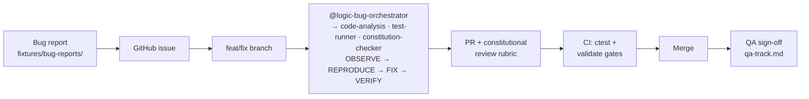

# Session 03 — Full SDLC Walkthrough: From Bug Report to Merged Fix

> **Audience:** game developers and QA engineers who finished the
> [learner guide](learner-guide.md) and want the complete loop — issue, branch,
> agent-driven fix, PR review, CI, merge — using
> [logic-bug-workshop-training.md](logic-bug-workshop-training.md) techniques on the
> [`output/ea-cpp-games`](../../output/ea-cpp-games/README.md) workspace.
> Pair this with the [QA track](qa-track.md) if you own sign-off rather than the fix.

## The loop at a glance



Worked example below: **BUG-002** (float accumulator drift). Every step generalizes to
the other seeded bugs — swap in the matching files from
[fixtures/seeded-bugs.md](../../output/ea-cpp-games/fixtures/seeded-bugs.md).

## Step 1 — Bug report becomes a GitHub issue

Start from the report on disk, not from memory. Ask Copilot to draft the issue:

```text
#file:output/ea-cpp-games/fixtures/bug-reports/BUG-002.md
Draft a GitHub issue from this bug report: title under 70 chars, body with
Symptom / Repro steps / Expected vs actual / Suspected area. Include the exact
ctest command that demonstrates the failure. Do not speculate on the fix.
```

Issue quality bar (also the QA intake bar):

- Repro commands are copy-pasteable — preset name, test filter, seed.
- "Expected vs actual" quotes observed numbers, not adjectives.
- No proposed fix in the issue. Diagnosis belongs to the branch.

## Step 2 — Branch, never main

```bash
cd output/ea-cpp-games
git switch -c fix/bug-002-accumulator-drift
```

Naming: `fix/bug-NNN-<slug>`. One bug per branch — the four-phase agent produces one
minimal diff, and review scales with diff size.

## Step 3 — Visual repro in the sandbox (optional but persuasive)

Some logic bugs are _visible_ before they are measurable. Run the interactive sandbox:

```bash
./build/apps/sandbox/ea-sandbox
```

- **BUG-002** — leave it running: the wall-clock vs sim-time HUD readouts drift apart.
- **BUG-004** — press `R` to reseed: the trace digest in the HUD diverges between runs
  that share a seed.

For evidence that survives a PR description, prefer the headless trace:

```bash
./build/apps/sandbox/ea-sandbox --headless --seed 42 --frames 600 --out trace-before.csv
# ...after the fix...
./build/apps/sandbox/ea-sandbox --headless --seed 42 --frames 600 --out trace-after.csv
diff trace-before.csv trace-after.csv
```

A determinism fix shows up as _identical_ traces across repeated post-fix runs; a drift
fix shows up as the accumulator column staying bounded. Attach both CSVs to the PR.

## Step 4 — Orchestrator-driven fix with HITL gates

Invoke the orchestrator (see
[.github/agents/logic-bug-orchestrator.agent.md](../../.github/agents/logic-bug-orchestrator.agent.md)).
It delegates to three sub-agents —
[code-analysis](../../.github/agents/code-analysis.agent.md) (OBSERVE),
[test-runner](../../.github/agents/test-runner.agent.md) (REPRODUCE / VERIFY), and
[constitution-checker](../../.github/agents/constitution-checker.agent.md) (FIX audit) —
and runs the CoT/ToT discipline from
[reasoning-cot-tot.instructions.md](../../.github/instructions/reasoning-cot-tot.instructions.md):

```text
@logic-bug-orchestrator Resolve BUG-002 — float accumulator drift.
Bug report: fixtures/bug-reports/BUG-002.md. Start with OBSERVE.
```

Each gate surfaces as a **handoff button** the orchestrator emits with `send: false`,
so nothing advances to the next phase until you click. You are the gate-keeper at four
points (training Section 6):

| Gate | Question                   | You approve only if…                                              |
| ---- | -------------------------- | ----------------------------------------------------------------- |
| 1    | Hypothesis plausible?      | Evidence cites file + line, confidence is stated, FPs dismissed.  |
| 2    | Constitutional compliance? | The plan names the violated article(s) — for BUG-002, Article 5.  |
| 3    | Test reproduces failure?   | The enabled `DISABLED_` test fails _before_ any source change.    |
| 4    | Fix minimal & safe?        | Diff touches only the defect; no drive-by refactors; tests green. |

If the agent skips a gate, stop it and restate the gate. The transcript of your
approvals becomes review evidence in Step 5.

## Step 5 — Pull request with the constitutional rubric

Open the PR with a body Copilot drafts from the diff:

```text
Draft a PR description for this branch: Problem / Root cause / Fix / Evidence.
Evidence must include the failing-then-passing test name and the ctest preset used.
Add a checklist mapping the fix to constitution articles 1–8, marking N/A where
genuinely not applicable.
```

Reviewers score against the eight articles of
[specs/constitution.md](../../output/ea-cpp-games/specs/constitution.md):

| Article           | Reviewer checks                                                  |
| ----------------- | ---------------------------------------------------------------- |
| 1 — No exceptions | No `try`/`catch`/`throw` introduced.                             |
| 2 — No RTTI       | No `dynamic_cast`/`typeid`.                                      |
| 3 — EASTL-first   | No new `std::` containers; interop boundaries labeled.           |
| 4 — Allocators    | New containers take an explicit allocator.                       |
| 5 — Determinism   | Same seed ⇒ same trace; no order-dependent iteration introduced. |
| 6 — Real-time     | No allocation/locks added to hot paths.                          |
| 7 — Test-first    | Regression test existed and failed before the fix commit.        |
| 8 — HITL gates    | Gate 1–4 approvals are quoted or linked in the PR body.          |

Article 7 is the one Copilot-generated fixes most often shortcut: verify the commit
order shows test-before-fix, not fix-with-test.

## Step 6 — CI gate

CI re-runs what you ran locally — green locally first, or don't push:

```bash
cd output/ea-cpp-games
ctest --preset default-debug --output-on-failure
ctest --preset optimized            # catches Debug-only "fixes" (see BUG-007)
cd ../.. && npm run validate:snippets
```

If your fix touched docs with ` ```cpp ` fences, `validate:snippets` compiles them —
non-compiling illustrative blocks must be fenced `cpp no-compile` or `text`.

## Step 7 — Merge and hand off to QA

Squash-merge with the issue reference (`Fixes #NN`) in the commit subject. Then the QA
sign-off in [qa-track.md](qa-track.md) takes over: regression sweep, trace comparison,
and the `DISABLED_` test restored to its disabled state with the fix verified.

## ToT at scale — parallel hypothesis branches with worktree-mcp

Tree of Thought in chat explores hypotheses _textually_. The
[worktree-mcp](../../output/ea-cpp-games/tools/worktree-mcp/) server lets you explore
them _executably_ — one git worktree per hypothesis, built and tested in parallel,
without the branches contaminating each other's build trees.

Register the server in `.vscode/mcp.json` (input prompt keeps paths out of the repo —
never hard-code absolute paths or tokens):

```json
{
  "inputs": [
    {
      "id": "repo-root",
      "type": "promptString",
      "description": "Absolute path to the ea-cpp-games checkout"
    }
  ],
  "servers": {
    "worktree": {
      "command": "node",
      "args": ["${input:repo-root}/tools/worktree-mcp/dist/index.js"],
      "env": { "REPO_ROOT": "${input:repo-root}" }
    }
  }
}
```

Then drive a three-expert ToT where each expert gets a real build:

```text
We are diagnosing BUG-004 (non-deterministic constraint traces). Propose three
distinct root-cause hypotheses. For each hypothesis: use create_worktree to make a
branch hypo/bug-004-<n>, apply the minimal probe change for that hypothesis only,
then cmake_build and run_tests in that worktree. Report per-hypothesis test results,
then use worktree_diff to show me the winning probe before any merge. Wait for my
approval between hypotheses.
```

The server exposes `create_worktree`, `list_worktrees`, `remove_worktree`,
`cmake_build`, `run_tests`, and `worktree_diff`. Two rules keep this safe:

- Worktrees are disposable — `remove_worktree` everything once a winner is merged.
- The winning diff still goes through Steps 4–6 above. Parallel exploration replaces
  guessing, not review.

## Where to go next

- [Exercises 03–06](exercises/) practice Steps 3–6 on BUG-007, BUG-008, BUG-009, and
  BUG-010 individually.
- The [QA track](qa-track.md) covers the verification half of this loop in depth.
- [docs/session-03-logic-bugs-runbook.md](../../docs/session-03-logic-bugs-runbook.md)
  catalogs every artifact this walkthrough touches.
